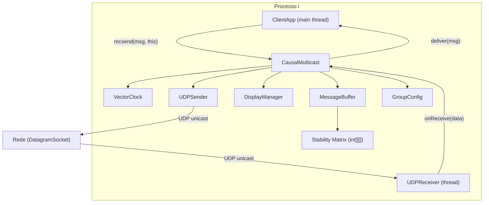

# 00 — Especificação Mestre: CausalMulticast Middleware

---

## 1. Visão Geral

Middleware Java que oferece comunicação multicast com **ordenamento causal de mensagens** sobre uma rede de processos. A camada de transporte usa exclusivamente **UDP unicast**. O grupo de participantes é estático e definido por arquivo de configuração. O middleware garante que mensagens sejam entregues ao cliente respeitando a relação *happened-before*, e implementa **estabilização via matriz de relógios vetoriais** para descarte seguro de mensagens já entregues a todos os processos. O controle manual via teclado permite atrasar envios individuais para fins de demonstração e avaliação.

---

## 2. Stack Tecnológico

| Componente | Escolha | Justificativa |
|---|---|---|
| Linguagem | Java 17 LTS | Estável, amplamente disponível, sem dependências externas |
| Build | `javac -encoding UTF-8` + `Makefile` | Leve, sem ferramentas extras; flag `-encoding UTF-8` obrigatória (Windows usa Windows-1252 por padrão) |
| Transporte | `java.net.DatagramSocket` / `DatagramPacket` (UDP) | Exigência do enunciado |
| Serialização | String delimitada (`\|` como separador) | Zero dependências |
| Concorrência | `synchronized` + `Thread` | Padrão Java, sem libs |
| Documentação | Javadoc | Exigência do enunciado |
| Bibliotecas externas | **Nenhuma** | Nenhuma lib de terceiros é permitida |

---

## 3. Estrutura de Diretórios

```
sd_trab2/
├── def.md                              # Enunciado original
├── 00_especificacao_mestre.md          # Este documento
├── prompt_modulo_N.md                  # Prompts de implementação (gerados sob demanda)
├── Makefile                            # Compilação, execução, Javadoc
├── group.cfg                           # Configuração do grupo (ip:porta por linha)
├── src/
│   └── CausalMulticast/
│       ├── ICausalMulticast.java       # Interface de callback
│       ├── CausalMulticast.java        # Classe principal do middleware
│       ├── Message.java                # Representação de mensagem
│       ├── VectorClock.java            # Relógio vetorial
│       ├── MessageBuffer.java          # Buffer + lógica de entrega causal + estabilização
│       ├── UDPSender.java              # Envio de datagramas unicast
│       ├── UDPReceiver.java            # Thread receptora de datagramas
│       ├── GroupConfig.java            # Leitura do group.cfg
│       └── DisplayManager.java         # Exibição do estado no terminal
├── src/
│   └── client/
│       └── ClientApp.java              # Aplicação cliente de teste
├── src/
│   ├── TestModulo1.java                # Script de validação do Módulo 1
│   ├── TestModulo2.java                # Script de validação do Módulo 2
│   ├── TestModulo3.java                # Script de validação do Módulo 3
│   └── TestModulo4.java                # Script de validação do Módulo 4 (interativo)
├── bin/                                # Classes compiladas (.class)
└── doc/                                # Javadoc gerado
```

> [!IMPORTANT]
> O pacote Java **deve** se chamar `CausalMulticast` (com maiúsculas), pois o professor importará via `import CausalMulticast.*;`.

---

## 4. Convenções

| Aspecto | Regra |
|---|---|
| Pacote do middleware | `CausalMulticast` |
| Pacote do cliente | `client` (default package também é aceitável) |
| Nomenclatura de classes | PascalCase (`VectorClock`, `MessageBuffer`) |
| Nomenclatura de métodos | camelCase (`mcsend`, `deliver`, `getStableMessages`) |
| Nomenclatura de constantes | UPPER_SNAKE_CASE (`MAX_DATAGRAM_SIZE`) |
| Nomenclatura de variáveis | camelCase |
| Comentários | Javadoc (`/** */`) em toda classe e método público |
| Encoding dos arquivos | UTF-8 |
| Tamanho máximo de datagrama | 65507 bytes (limite prático UDP) — definir constante `MAX_DATAGRAM_SIZE = 65507` |
| Tratamento de erros | `try-catch` local com log no `stderr`; nunca engolir exceção silenciosamente |
| Thread safety | Todos os acessos a estado compartilhado (buffer, relógios, matriz) devem ser `synchronized` no mesmo monitor |

---

## 5. Arquitetura



### Fluxo de Envio (`mcsend`)

1. Incrementa `vectorClock[selfIndex]`.
2. Cria `Message(selfIndex, vectorClock.copy(), payload)`.
3. Serializa a mensagem em string delimitada.
4. Para cada membro `j` do grupo (exceto `self`):
   - Imprime prompt: `"Enviar para Processo j (ip:porta)? [S/n]: "`
   - Se **sim** (ou Enter): envia via `UDPSender`.
   - Se **não**: armazena em fila de **mensagens atrasadas** (`delayedQueue`).
5. Entrega local: o próprio remetente entrega a mensagem a si mesmo imediatamente (já está causalmente ordenada).
6. Atualiza linha `self` da matriz de estabilidade.
7. Imprime estado atual via `DisplayManager`.

### Fluxo de Recepção (thread `UDPReceiver`)

1. Recebe datagrama e desserializa em `Message`.
2. Adiciona ao `MessageBuffer`.
3. Executa **loop de entrega causal**:
   - Para cada mensagem `m` no buffer, de sender `j`, com timestamp `VT(m)`:
     - Entrega se **ambas** condições forem satisfeitas:
       - `VT(m)[j] == vectorClock[j] + 1` (próxima esperada de `j`)
       - `∀k ≠ j : VT(m)[k] ≤ vectorClock[k]` (já vimos tudo que `j` viu)
     - Ao entregar: `vectorClock[j] = VT(m)[j]`
     - Chama `client.deliver(msg)`.
   - Repete o loop até que nenhuma nova entrega ocorra (ponto fixo).
4. Atualiza `stabilityMatrix[senderIndex] = max(stabilityMatrix[senderIndex], VT(m))`.
5. Executa **garbage collection de estabilidade**:
   - Para cada mensagem `m` no buffer, de sender `j`, com timestamp `VT(m)`:
     - `m` é **estável** se `∀k : stabilityMatrix[k][j] ≥ VT(m)[j]`
     - Remove mensagens estáveis do buffer.
6. Imprime estado atual via `DisplayManager`.

### Fluxo de Liberação de Mensagem Atrasada

1. Usuário seleciona opção "Liberar mensagem atrasada" no menu do `ClientApp`.
2. Lista mensagens em `delayedQueue` com índice.
3. Usuário escolhe qual liberar.
4. Middleware envia via `UDPSender` o datagrama previamente montado.
5. Remove da `delayedQueue`.

---

## 6. Esquema de Dados

### 6.1 `VectorClock`

| Campo | Tipo | Descrição |
|---|---|---|
| `clock` | `int[]` | Vetor de tamanho N (número de processos) |

Operações:
- `increment(int index)` — incrementa `clock[index]`.
- `merge(int[] other)` — `clock[i] = max(clock[i], other[i])` para todo `i`.
- `copy()` — retorna cópia do array.
- `toString()` — representação legível.

### 6.2 Stability Matrix

Não é uma classe separada — é um campo `int[][] stabilityMatrix` em `CausalMulticast` (ou `MessageBuffer`), dimensão `N × N`.

- `stabilityMatrix[i]` = conhecimento que o processo local tem sobre o relógio vetorial do processo `i`.
- `stabilityMatrix[selfIndex]` = cópia do próprio `vectorClock` (atualizado a cada envio/entrega).
- `stabilityMatrix[j]` para `j ≠ selfIndex` = atualizado ao receber mensagem de `j`.

### 6.3 `Message`

| Campo | Tipo | Descrição |
|---|---|---|
| `senderIndex` | `int` | Índice do remetente no grupo |
| `timestamp` | `int[]` | Cópia do vetor de relógio no momento do envio |
| `payload` | `String` | Conteúdo textual da mensagem |

### 6.4 `MessageBuffer`

| Campo | Tipo | Descrição |
|---|---|---|
| `pending` | `List<Message>` | Mensagens recebidas aguardando entrega causal |

### 6.5 Delayed Queue (em `CausalMulticast`)

| Campo | Tipo | Descrição |
|---|---|---|
| `delayedQueue` | `List<DelayedEntry>` | Mensagens serializadas aguardando liberação manual |

Onde `DelayedEntry` contém: `byte[] datagram`, `InetAddress destAddr`, `int destPort`, `String description` (para exibição).

### 6.6 `GroupConfig`

| Campo | Tipo | Descrição |
|---|---|---|
| `members` | `List<Member>` | Lista ordenada de membros |

Onde `Member` contém: `String ip`, `int port`. O índice na lista é o índice do processo.

### 6.7 Formato do `group.cfg`

```
# Linhas começando com # são comentários
# Formato: ip:porta (uma por linha)
# O índice do processo é definido pela posição na lista (0-indexed)
127.0.0.1:5001
127.0.0.1:5002
127.0.0.1:5003
```

---

## 7. Contratos de API

### 7.1 Interface `ICausalMulticast`

```java
public interface ICausalMulticast {
    void deliver(String msg);
}
```

### 7.2 Classe `CausalMulticast`

```java
public CausalMulticast(String ip, Integer port, ICausalMulticast client)
public void mcsend(String msg, ICausalMulticast cliente)
```

> [!NOTE]
> O parâmetro `cliente` em `mcsend` é redundante com o do construtor. O middleware **deve** usar o `cliente` passado em `mcsend` para o callback de entrega da mensagem local, mantendo compatibilidade com o código do professor. Para entregas de mensagens recebidas de outros processos, usa-se o `client` do construtor.

### 7.3 Formato de Serialização UDP

```
senderIndex|vc0,vc1,...,vcN-1|payload
```

**Regras de parsing:**
- Separador principal: `|` (pipe).
- Separar apenas nos **dois primeiros** `|`. Tudo após o segundo `|` é payload (payload pode conter `|`).
- `senderIndex`: inteiro, índice do remetente na lista de membros.
- `vc0,vc1,...`: inteiros separados por vírgula, representando o vetor de relógio.
- `payload`: string UTF-8.

**Exemplo** (3 processos, sender = 1, VC = [0,2,1], payload = "Olá mundo"):
```
1|0,2,1|Olá mundo
```

### 7.4 Saída do `DisplayManager`

Após cada evento significativo (envio, recepção, entrega, estabilização), imprimir:

```
========================================
[Processo 0 - 127.0.0.1:5001]
── Relógio Vetorial: [2, 0, 1]
── Matriz de Estabilidade:
   P0: [2, 0, 1]
   P1: [1, 0, 0]
   P2: [0, 0, 0]
── Buffer (mensagens pendentes): 1
   [P1 | VC=[0,1,0] | "Mensagem teste"]
── Mensagens atrasadas: 0
========================================
```

---

## 8. Contratos Internos (entre classes)

### `UDPSender`

```java
public void send(byte[] data, InetAddress address, int port)
```

### `UDPReceiver`

```java
// Construtor recebe o socket e um callback
public UDPReceiver(DatagramSocket socket, MessageHandler handler)
// Implementa Runnable; executa em thread separada
```

Onde `MessageHandler` é uma interface funcional:
```java
public interface MessageHandler {
    void onReceive(byte[] data, int length);
}
```

### `GroupConfig`

```java
public static GroupConfig load(String filePath)
public int size()
public Member getMember(int index)
public int indexOf(String ip, int port)
```

### `VectorClock`

```java
public void increment(int index)
public void merge(int[] other)
public int[] copy()
public int get(int index)
public boolean canDeliver(int[] msgTimestamp, int senderIndex)
```

> [!IMPORTANT]
> O método `canDeliver` encapsula a regra de entrega causal:
> - `msgTimestamp[senderIndex] == clock[senderIndex] + 1`
> - `∀k ≠ senderIndex : msgTimestamp[k] ≤ clock[k]`

### `MessageBuffer`

```java
public void add(Message msg)
public List<Message> getDeliverableMessages(VectorClock vc)
public void remove(Message msg)
public List<Message> getStableMessages(int[][] stabilityMatrix)
public List<Message> getAll()
```

---

## 9. Roadmap de Módulos

| # | Módulo | Arquivos | Dependências | Status |
|---|---|---|---|---|
| 1 | **Núcleo — Estruturas de Dados** | `ICausalMulticast.java`, `Message.java`, `VectorClock.java`, `GroupConfig.java` | Nenhuma | ✅ Concluído |
| 2 | **Transporte UDP** | `UDPSender.java`, `UDPReceiver.java`, `MessageHandler.java` | Módulo 1 | ✅ Concluído |
| 3 | **Ordenação Causal e Estabilização** | `MessageBuffer.java`, `CausalMulticast.java` | Módulos 1, 2 | ✅ Concluído |
| 4 | **Controle Interativo e Display** | `DisplayManager.java`, lógica de delay em `CausalMulticast.java` | Módulo 3 | ✅ Concluído |
| 5 | **Cliente de Teste, Build e Documentação** | `ClientApp.java`, `Makefile`, Javadoc | Módulos 1–4 | ✅ Concluído |

---

## 10. Decisões Registradas

| # | Data | Decisão | Origem |
|---|---|---|---|
| D1 | 2026-06-15 | Java 17 LTS | Arquiteto (aprovado pelo usuário) |
| D2 | 2026-06-15 | Build com `javac` + `Makefile` | Usuário |
| D3 | 2026-06-15 | Serialização por string delimitada (`\|`) | Usuário |
| D4 | 2026-06-15 | Grupo de tamanho N arbitrário | Usuário |
| D5 | 2026-06-15 | Configuração de grupo via `group.cfg` | Usuário |
| D6 | 2026-06-15 | Documentação via Javadoc | Usuário |
| D7 | 2026-06-15 | Nenhuma biblioteca externa permitida | Enunciado |
| D8 | 2026-06-15 | Grupo estático, sem entrada/saída dinâmica | Flexibilização do professor |
| D9 | 2026-06-15 | `synchronized` para thread safety (sem libs de concorrência) | Arquiteto |
| D10 | 2026-06-15 | Parsing de `Message` via `indexOf`/`substring` (sem Regex) para performance | Operário (Módulo 1) |
| D11 | 2026-06-15 | Flag `-encoding UTF-8` obrigatória no `javac` (Windows usa Windows-1252 por padrão) | Operário (Módulo 1) |
| D12 | 2026-06-15 | `UDPReceiver.stop()` não fecha o socket (responsabilidade da camada superior); exceção de `receive()` após `socket.close()` é suprimida se `running == false` | Operário (Módulo 2) |
| D13 | 2026-06-15 | Cópia defensiva (`Arrays.copyOf`) no `UDPReceiver` para recortar buffer antes de passar ao handler | Operário (Módulo 2) |
| D14 | 2026-06-15 | `lock` interno (`Object`) em `CausalMulticast` exposto via `getLock()` para composição com Módulo 4; getters de estado (`getStabilityMatrix()`, etc.) devem ser acessados dentro de `synchronized(getLock())` | Operário (Módulo 3) |
| D15 | 2026-06-15 | Garbage collection de estabilidade usa `removeAll` atômico no fim do bloco `synchronized` para prevenir corrupção de iterador | Operário (Módulo 3) |
| D16 | 2026-06-15 | Scanner lê `System.in` dentro de `synchronized(lock)`, bloqueando recepção enquanto usuário decide — intencional para controle acadêmico de ritmo | Operário (Módulo 4) |
| D17 | 2026-06-15 | `ClientApp` em default package (sem `package`) para simplificar execução: `java -cp bin ClientApp` | Operário (Módulo 5) |
| D18 | 2026-06-15 | Makefile usa `rm -rf` para compatibilidade GNU Make Linux/Windows (Unix-like utils) | Operário (Módulo 5) |
