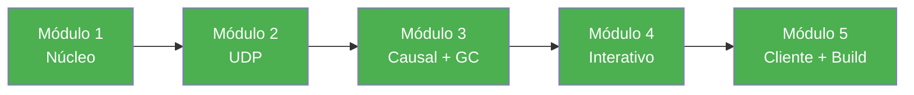

# Walkthrough — CausalMulticast Middleware

## Projeto Concluído ✅

Middleware Java para comunicação multicast com **ordenamento causal** sobre UDP unicast, desenvolvido para a disciplina ELC1018 — Sistemas Distribuídos.

---

## Arquivos do Projeto

### Middleware (`src/CausalMulticast/` — 10 arquivos)

| Arquivo | Módulo | Função |
|---|---|---|
| `ICausalMulticast.java` | 1 | Interface de callback `deliver(String msg)` |
| `Message.java` | 1 | Serialização/desserialização (`senderIndex\|vc0,vc1,...\|payload`) |
| `VectorClock.java` | 1 | Relógio vetorial com `canDeliver()` para ordenação causal |
| `GroupConfig.java` | 1 | Leitura do `group.cfg` estático |
| `MessageHandler.java` | 2 | Interface funcional `onReceive(byte[], int)` |
| `UDPSender.java` | 2 | Envio de datagramas unicast |
| `UDPReceiver.java` | 2 | Thread daemon de recepção contínua |
| `MessageBuffer.java` | 3 | Buffer com consultas de entrega causal e estabilidade |
| `CausalMulticast.java` | 3+4 | Orquestrador: VC, matriz N×N, entrega, GC, delay interativo |
| `DisplayManager.java` | 4 | Formatação de estado no terminal |

### Aplicação e Build

| Arquivo | Módulo | Função |
|---|---|---|
| `src/client/ClientApp.java` | 5 | Cliente interativo (menu terminal) |
| `Makefile` | 5 | Build, execução, Javadoc, testes |
| `group.cfg` | 1 | Config de grupo (3 membros localhost) |

### Testes

| Arquivo | Valida |
|---|---|
| `TestModulo1.java` | Serialização, VectorClock.canDeliver, GroupConfig |
| `TestModulo2.java` | Envio/recepção UDP loopback |
| `TestModulo3.java` | Entrega causal com 3 processos in-JVM |
| `TestModulo4.java` | Controle interativo de atraso |

---

## Como Usar

### Compilar
```bash
make compile
```

### Executar (3 terminais)
```bash
# Terminal 1:
make run1

# Terminal 2:
make run2

# Terminal 3:
make run3
```

### Gerar Javadoc
```bash
make javadoc
```

### Rodar testes
```bash
make test1   # Módulo 1
make test2   # Módulo 2
make test3   # Módulo 3
```

---

## Decisões de Engenharia (D1–D18)

| # | Decisão |
|---|---|
| D1 | Java 17 LTS |
| D2 | Build com `javac` + `Makefile` |
| D3 | Serialização por string delimitada (`\|`) |
| D4 | Grupo N arbitrário |
| D5 | Config via `group.cfg` |
| D6 | Javadoc |
| D7 | Zero bibliotecas externas |
| D8 | Grupo estático (flexibilização do professor) |
| D9 | `synchronized` para thread safety |
| D10 | Parsing via `indexOf`/`substring` (sem Regex) |
| D11 | `-encoding UTF-8` obrigatório no `javac` |
| D12 | `UDPReceiver.stop()` não fecha socket |
| D13 | Cópia defensiva no `UDPReceiver` |
| D14 | `getLock()` exposto para composição |
| D15 | GC via `removeAll` atômico |
| D16 | Scanner dentro de `synchronized` (intencional) |
| D17 | `ClientApp` em default package |
| D18 | Makefile com `rm -rf` multiplataforma |

---

## Fluxo de Desenvolvimento



Todos os 5 módulos concluídos em uma sessão. Nenhuma pendência técnica aberta.
